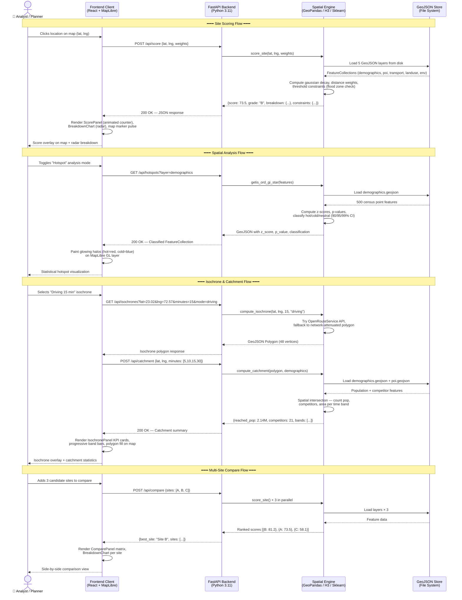

# 🗺️ GeoSpatial Site Readiness Analyzer

> **AI-Powered multi-layer geospatial analysis platform for evaluating site readiness across Gujarat, India.**
> Built for BitNBuild Internal Hackathon 2026.

---

## 📌 Project Overview

**GeoSpatial Site Readiness Analyzer** is an AI-powered location intelligence and spatial analytics platform tailored for evaluating industrial, commercial, and retail site viability across Gujarat, India. By ingesting and cross-referencing multi-layer geospatial datasets—demographics, arterial highways, commercial competitor points of interest (POIs), municipal land-use parcels, and environmental flood hazards—the system provides decision-makers with instant site scoring, statistical clustering, and accessibility reach analytics.

### 🌟 Key Features
- **Composite 6-Archetype Site Scoring**: Real-time evaluation engine with customized rule profiles and weights for **EV Fast Charging**, **Retail Commercial**, **Industrial Warehouse**, **5G Telecom**, **Solar Utility PV**, and **Wind Turbine**.
- **Renewable Resource Intelligence**: Gujarat NIWE/VORTEX 120m hub-height wind atlas interpolation, seasonal wind speed profiles, CUF estimation, and water-body setback disqualification constraints.
- **Advanced Spatial Analytics**: Getis-Ord Gi* statistical hot/cold spot detection (90/95/99% confidence), DBSCAN spatial clustering for POI density, and multi-resolution Uber H3 hexagonal binning.
- **Multi-Modal Catchment & Isochrones**: Driving, walking, and cycling travel-time contour generation paired with demographic population catchment and competitor counts across 5, 10, 15, and 30-minute horizons.
- **Interactive Freeform Drawing & Custom Scoring**: User-defined polygon and rectangle ROI boundary drawing with live area calculation and aggregated site score computation via Turf.js.
- **Multi-Site Comparison & Dossier Export**: Side-by-side candidate comparison matrix, radar factor breakdowns, downloadable JSON/CSV reports, and printable executive assessment dossiers.

---

## 📐 System Architecture

```mermaid
graph TB
    subgraph CLIENT["🖥️ Frontend — React 18 + Vite + TypeScript"]
        direction LR
        MAP["MapLibre GL JS<br/>Interactive Map"]
        SCORE_UI["ScorePanel<br/>Animated Counter"]
        RADAR["BreakdownChart<br/>Recharts Radar"]
        COMPARE_UI["ComparePanel<br/>Multi-Site Matrix"]
        ISO_UI["IsochronePanel<br/>Catchment KPIs"]
        DRAW["DrawToolbar<br/>Polygon Drawing"]
        LEGEND["HotspotLegend<br/>Z-Score Ramp"]
    end

    subgraph GATEWAY["⚡ API Gateway — FastAPI + Python 3.11"]
        direction LR
        HEALTH["/api/health"]
        SCORE_API["/api/score<br/>POST — Composite Scoring"]
        COMPARE_API["/api/compare<br/>POST — Rank Sites"]
        HOTSPOT_API["/api/hotspots<br/>GET — Getis-Ord Gi*"]
        CLUSTER_API["/api/clusters<br/>GET — DBSCAN"]
        H3_API["/api/h3<br/>GET — Hex Binning"]
        ISO_API["/api/isochrones<br/>GET — Travel Polygons"]
        CATCH_API["/api/catchment<br/>POST — Pop. Reach"]
        LAYERS_API["/api/layers<br/>GET — Layer Registry"]
    end

    subgraph ENGINE["🧠 Spatial Engine"]
        direction LR
        SCORING["Scoring Engine<br/>5-Layer Weighted<br/>Gaussian Decay"]
        DBSCAN["DBSCAN Clustering<br/>Scikit-Learn"]
        GETIS["Getis-Ord Gi*<br/>Hot/Cold Spots"]
        H3_ENGINE["H3 Hexagonal<br/>Uber H3 res 4-9"]
        ISOCHRONE["Isochrone Engine<br/>ORS + Fallback"]
        CATCHMENT["Catchment Analysis<br/>Pop. Aggregation"]
    end

    subgraph DATA["💾 GeoJSON Data Store — File-Based"]
        direction LR
        DEMO["demographics.geojson<br/>500 census points"]
        TRANS["transportation.geojson<br/>6 highway lines"]
        POI["poi.geojson<br/>250 competitor points"]
        LAND["landuse.geojson<br/>7 zoning parcels"]
        ENV["environment.geojson<br/>4 flood/hazard zones"]
        BOUND["gujarat_boundary.geojson"]
    end

    CLIENT -->|"HTTP/JSON via Vite Proxy :5173 → :8000"| GATEWAY
    GATEWAY --> ENGINE
    ENGINE --> DATA

    style CLIENT fill:#0d1b2a,stroke:#38bdf8,stroke-width:2px,color:#e2e8f0
    style GATEWAY fill:#1a0d2e,stroke:#a78bfa,stroke-width:2px,color:#e2e8f0
    style ENGINE fill:#0d2818,stroke:#34d399,stroke-width:2px,color:#e2e8f0
    style DATA fill:#2d1810,stroke:#fb923c,stroke-width:2px,color:#e2e8f0
```



---

## 🔄 System Sequence Flow



---

## 🛠️ Tech Stack

| Layer | Technology | Purpose |
|-------|-----------|---------|
| **Frontend** | React 18 + Vite + TypeScript | SPA framework & build tooling |
| **Map** | MapLibre GL JS | Open-source vector map rendering |
| **Charts** | Recharts | Radar & bar chart breakdowns |
| **State** | Zustand + React Query | Client state & server cache |
| **Backend** | Python 3.11 + FastAPI | REST API server |
| **Spatial** | GeoPandas, Shapely, H3-py | Geometry operations & hex binning |
| **Clustering** | Scikit-Learn (DBSCAN) | Density-based spatial clustering |
| **Hotspots** | libpysal / esda | Getis-Ord Gi* statistics |
| **Isochrones** | OpenRouteService API | Travel-time polygon computation |
| **Data** | GeoJSON (file-based) | 5 geospatial layers for Gujarat |
| **DevOps** | Docker + Docker Compose | Containerized deployment |

---

## 🧑‍💻 Team

| Member | Role | Scope |
|--------|------|-------|
| **Moksh [M]** | Core + Scoring | Scoring engine, compare API, ScorePanel, BreakdownChart, ComparePanel, Sidebar |
| **Daksh [D]** | Map + Spatial + DevOps | MapView, spatial algorithms (DBSCAN, Gi*, H3), DrawToolbar, Docker |
| **Maharshi [R]** | Data + Accessibility | Data pipeline, isochrone/catchment engine, IsochronePanel, ReportExport |

---

## 🚀 Quick Start

```bash
# Docker (recommended)
docker compose up --build

# Manual
# Terminal 1 — Backend
cd backend && python -m venv venv && venv\Scripts\activate
pip install -r requirements.txt
uvicorn backend.main:app --host 0.0.0.0 --port 8000 --reload

# Terminal 2 — Frontend
cd frontend && npm install && npm run dev
```

| Service | URL |
|---------|-----|
| Frontend UI | http://localhost:5173 |
| Backend API | http://localhost:8000 |
| Swagger Docs | http://localhost:8000/docs |

---

## 📁 Project Structure

```
project/
├── backend/
│   ├── main.py                    # FastAPI app entry
│   ├── scoring/engine.py          # 5-layer weighted scoring
│   ├── spatial/
│   │   ├── clustering.py          # DBSCAN
│   │   ├── hotspot.py             # Getis-Ord Gi*
│   │   └── h3_binning.py          # Uber H3
│   ├── accessibility/
│   │   ├── isochrone.py           # Travel-time polygons
│   │   └── catchment.py          # Population reach
│   ├── data/loader.py             # GeoJSON file loader
│   └── api/
│       ├── routes_score.py
│       ├── routes_compare.py
│       ├── routes_hotspot.py
│       ├── routes_isochrone.py
│       └── routes_layers.py
├── frontend/
│   └── src/
│       ├── components/
│       │   ├── MapView.tsx         # MapLibre GL map
│       │   ├── HotspotLegend.tsx   # Z-score legend
│       │   ├── BreakdownChart.tsx  # Recharts radar
│       │   ├── ComparePanel.tsx    # Multi-site matrix
│       │   ├── IsochronePanel.tsx  # Catchment KPIs
│       │   └── DrawToolbar.tsx     # Polygon drawing
│       ├── hooks/
│       │   ├── useSpatialAnalytics.ts
│       │   ├── useCompareApi.ts
│       │   └── useIsochrone.ts
│       └── routes/MapWorkspace.tsx
├── data/                          # GeoJSON layers
│   ├── demographics.geojson       # 500 features
│   ├── transportation.geojson     # 6 highways
│   ├── poi.geojson               # 250 POIs
│   ├── landuse.geojson           # 7 zones
│   └── environment.geojson       # 4 hazard areas
├── docker/
│   ├── backend.Dockerfile
│   └── frontend.Dockerfile
└── docker-compose.yml
```

---

## 📄 License

Internal hackathon project — BitNBuild 2026.
